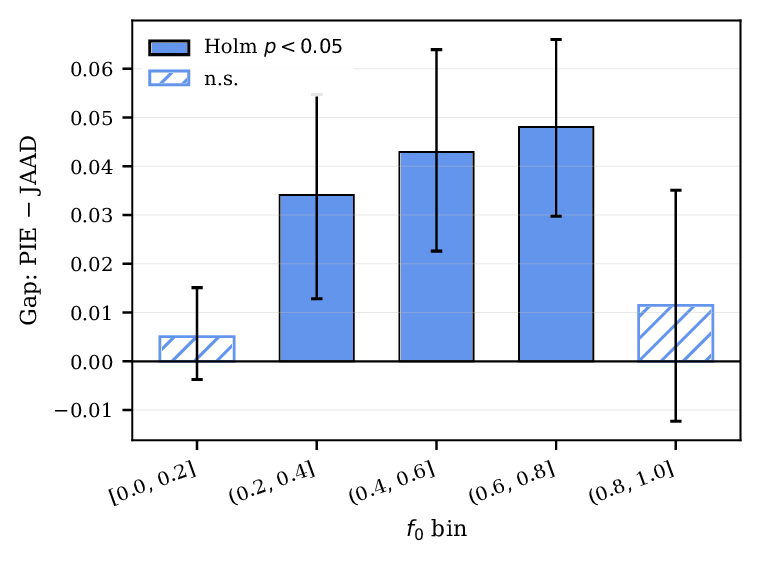

# Confidence-Controlled XAI Auditing for Pedestrian Detection under Domain Shift

Reproducibility package for the paper **“Confidence-Controlled XAI Auditing for Pedestrian Detection under Domain Shift”** (IEEE ICVES 2026).

The repository implements a confidence-controlled audit of post-hoc explanations for a fixed YOLOv8s pedestrian detector across the PIE and JAAD driving datasets. It compares **D-RISE** and **EigenCAM** under a common ROI-based D-Deletion protocol and includes the statistical analyses used in the paper: bootstrap confidence intervals, Mann–Whitney U tests, paired Wilcoxon tests, Cliff’s delta, Holm correction, score-coupling analysis, matched-`f0` cross-domain comparisons, normalized-AUC sensitivity, alternative `f0` bins, and descriptive size/occlusion checks.

## Repository structure

```text
.
├── src/                         # Experimental and analysis code
│   ├── config.py
│   ├── interfaces.py
│   ├── wiring.py
│   ├── launch.py
│   ├── fit_terciles.py
│   ├── run_audit.py
│   ├── aggregate.py
│   ├── make_figures.py
│   └── make_qualitative.py
├── results/
│   ├── terciles.json            # Frozen pre-hoc confidence thresholds
│   ├── eval_index/              # Detected-instance metadata
│   ├── records/                 # Raw per-seed audit records (6000 rows total)
│   ├── agg_*.csv                # Aggregated statistical outputs
│   └── fig_*.pdf                # Re-generated quantitative figures
├── data/
│   └── README.md                # Dataset setup instructions; raw data not included
├── docs/
│   ├── assets/                  # README figures (PNG)
│   ├── code_audit.md
│   ├── reproducibility.md
│   ├── tested_environment.md
│   └── results_reference.md
├── tests/
│   └── test_reproducibility.py
├── requirements.txt
├── environment.yml
├── CITATION.cff
├── THIRD_PARTY_NOTICES.md
├── LICENSE
└── .gitignore
```

## Two reproducibility paths

### 1. Reproduce the statistics without downloading PIE/JAAD

The raw JSONL audit records are included. This path does **not** require the driving datasets or a GPU.

```bash
python src/aggregate.py --metric deletion_auc
python src/make_figures.py
```

The main CSV outputs are regenerated in `results/`.

A lightweight regression check is also included:

```bash
python -m unittest discover -s tests -v
```

### 2. Re-run the full XAI audit

The full audit requires the PIE and JAAD datasets, their official Python interfaces, YOLOv8s, and preferably a CUDA-capable GPU.

1. Follow `data/README.md` to prepare PIE and JAAD.
2. Make the official `pie_data.py` and `jaad_data.py` interfaces importable (for example by placing them in `src/` or adding their folders to `PYTHONPATH`).
3. Verify the detector and dataset loaders:

```bash
python src/launch.py selftest
```

4. Freeze the confidence terciles and detected-instance pools:

```bash
python src/launch.py fit
```

5. Run a small end-to-end check:

```bash
python src/launch.py smoke
```

6. Run the complete audit:

```bash
python src/launch.py audit
```

7. Reconstruct the statistical results and figures:

```bash
python src/aggregate.py --metric deletion_auc
python src/make_figures.py
python src/make_qualitative.py --bin-lo 0.6 --bin-hi 0.8 --seeds 0 1 2 3 4
```

The audit is append-only and resumable: interrupted runs continue from completed `(instance, method, seed)` records.

## Core experimental configuration

| Setting | Value |
|---|---:|
| Detector | YOLOv8s pretrained on COCO, fixed |
| Inference confidence threshold | 0.001 |
| TP criterion | IoU ≥ 0.5 |
| Minimum GT height | 30 px |
| Evaluation sample | 300 instances/domain, balanced across confidence terciles |
| D-RISE masks | 2000 |
| Mask grid | 8 × 8 |
| Mask activation probability | 0.5 |
| D-RISE seeds | 5 |
| ROI margin | 1.0 (approximately 3× target box dimensions) |
| D-Deletion steps | 25 |
| Maximum deleted fraction | 0.5 |
| Main controlled `f0` bins | 0.0, 0.2, 0.4, 0.6, 0.8, 1.0 |
| Alternative sensitivity bins | width 0.25 |
| Bootstrap resamples | 10,000 |

The paper reports the raw ROI-based D-Deletion AUC as the primary metric. The response-normalized variant is retained as a sensitivity diagnostic.

## Main results

All values are reproduced exactly from the included records (`results/records/`). Lower D-Deletion AUC means a more faithful explanation.

**1. Deletion-based faithfulness is coupled to detection strength.** Global Spearman correlation between raw D-Deletion AUC and `f0`:

| Explainer | All | PIE | JAAD |
|---|---:|---:|---:|
| D-RISE | 0.76 | 0.70 | 0.82 |
| EigenCAM | 0.74 | 0.68 | 0.80 |

**2. At matched detection strength, D-RISE faithfulness differs between domains.** PIE − JAAD gap in raw D-Deletion AUC (D-RISE):

| `f0` bin | Gap | 95% CI | Cliff's δ | Holm p |
|---|---:|---:|---:|---:|
| [0.0, 0.2] | 0.005 | [−0.004, 0.015] | 0.16 | 0.382 |
| (0.2, 0.4] | **0.034** | [0.013, 0.055] | 0.42 | **0.002** |
| (0.4, 0.6] | **0.043** | [0.023, 0.063] | 0.35 | **0.002** |
| (0.6, 0.8] | **0.048** | [0.030, 0.066] | 0.40 | **<0.001** |
| (0.8, 1.0] | 0.011 | [−0.013, 0.034] | 0.14 | 0.382 |

The pattern holds under a response-normalized deletion variant and under alternative `f0` bins of width 0.25 (`results/agg_crossdomain_controlled_norm.csv`, `results/agg_crossdomain_controlled_bins025.csv`). EigenCAM shows a weaker and less consistent pattern; the gap is positive in most bins, but no bin survives Holm correction.

<p align="center">
  
</p>

**3. D-RISE is substantially more faithful than EigenCAM.** Over 600 paired instances, mean raw AUC is 0.112 (D-RISE) versus 0.350 (EigenCAM), median paired difference −0.179 (Wilcoxon signed-rank, p < 0.001).

See `docs/results_reference.md` for record counts, residual `f0` balance per bin, and further integrity checks.

## Data availability

Raw PIE and JAAD images/videos are **not redistributed** in this repository. The included `eval_index` and audit records contain derived evaluation metadata and numerical results only.

- PIE official repository: https://github.com/aras62/PIE
- PIE dataset page: https://data.nvision2.eecs.yorku.ca/PIE_dataset/
- JAAD official repository: https://github.com/ykotseruba/JAAD
- JAAD dataset page: https://data.nvision2.eecs.yorku.ca/JAAD_dataset/

Please follow the original dataset licenses and citation requirements. See `THIRD_PARTY_NOTICES.md`.

## Environment

The experiments were run with Python 3.10 on an NVIDIA RTX 3060 (6 GB). The recorded environment used Ultralytics 8.4.87, NumPy 1.26.4, pandas 2.3.3, SciPy 1.15.3, Matplotlib 3.10.8, and PyTorch 2.11.0 with a CUDA 12.6 build.

For a compact setup:

```bash
conda env create -f environment.yml
conda activate confidence-xai
```

For GPU execution, install the PyTorch build appropriate for the local CUDA stack before running the full audit. The analysis-only path does not require CUDA.

## Citation

If this repository contributes to your work, please cite the accompanying paper:

```bibtex
@inproceedings{florezzela2026confidence,
  author    = {Florez-Zela, Ruben Dario},
  title     = {Confidence-Controlled XAI Auditing for Pedestrian Detection under Domain Shift},
  booktitle = {2026 IEEE International Conference on Vehicular Electronics and Safety (ICVES)},
  year      = {2026}
}
```

Bibliographic metadata can be updated with the final DOI after publication.

## License

The original code in this repository is released under the MIT License. External datasets, interfaces, model weights, and third-party software retain their own licenses.
